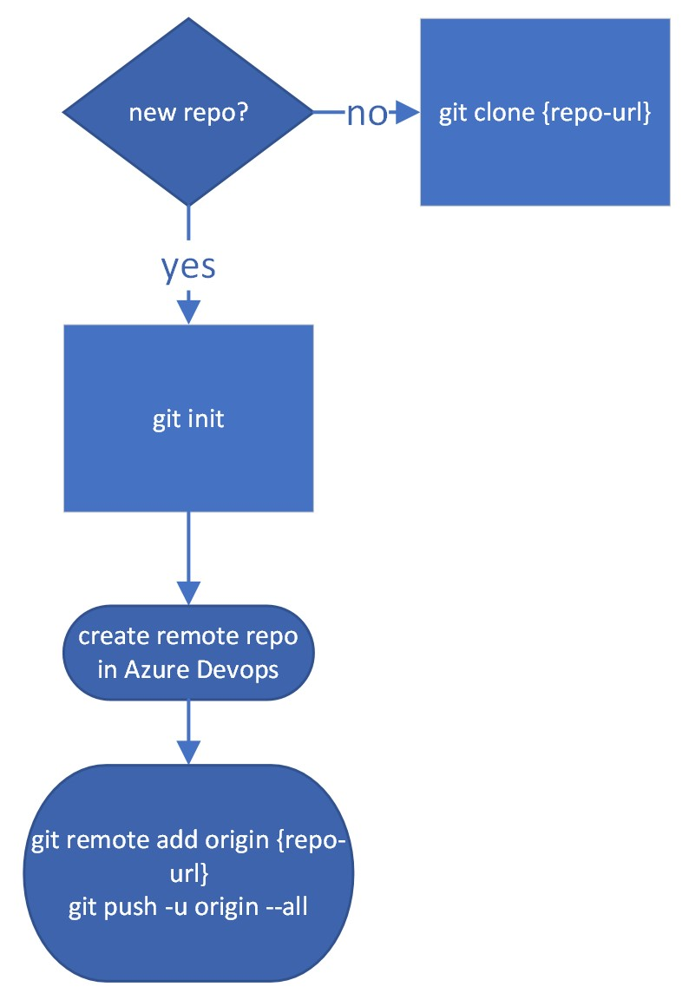

# A Brief, Practical Guide to Git

## But first, some key terms

What is git?
- Code evolves quickly. We need to keep track of changes over time. We need to make sure everyone on the team is working from the same version. Sometimes things break and we need to go back in time to a previous version. 

**Git is a techonology that allows us to <mark>time travel with code.**</mark> In other words, a version control system. Creating, navigating across, and manipulating discrete code versions is a powerful way to help ensure reliability, stability, portability and reproducability of software.

What is a repository?
- A repository or repo is **where your code lives**. There can be multiple copies of a repository, i.e. your local copy, a teammate's local copy, the copy on Azure Devops' servers or GitHub's servers. Each copy contains the  complete multiverse of everything you're tracking in git for your project.  

What is a branch?
- When time travelling, there is a timeline. **A branch is a timeline** in a specific universe inside your git repository. Each git repository has at lease one (default) branch, e.g. main. (avoid using master, it's problematic)

What is a commit?
- **A commit is a snapshot in time** on the branch. You choose when you want to make a snapshot, and git will record all the information needed to bring you back to that state of your code. 

Now, say you want to change reality... change the logic inside a function, for example. With git, you can create an alternate universe whenever you want to by creating a new branch. **New branches are cheap** to create.
- **Creating a new branch has no effect on any other branches.** You are safe to experiment and alter reality however you see fit.
- If you want to make your new reality, e.g. your improved function, the "real" reality on the main branch, you can merge the new branch back into the main branch

## Other terms
What is local/remote?
- In git parlance, your **personal copy of the repo is local**, as well as that of your other teammates. The remote is typically hosted on a service like Azure Devops, and has a GUI and additional functionality like pull requests. The **remote is the one that everyone syncs with**. 

What is HEAD?
- It's **your current position**, in terms of commits, on the current branch. If git is the time machine, turning the dial moves HEAD to the time to which you want to travel. By default it will keep pointing to the newest commit on the current branch.

## OK, enough terms. How do we actually use git in our projects?

First, you need a repository.

Now what? There is an overwhelming number of git commands. How do you string them together into a practical workflow? One workflow, [GitHub Flow](https://githubflow.github.io/), is relatively simple and also one I happen to have experience using.

Below is my attempt at a flowchart, spelling out how the typical commands can fit together, along with tasks completed using a service like Azure Devops or GitHub.

Some notes on the above:
- the branch name should be descriptive of the task, feature, or bugfix you intend to work on
- `git add` adds changes to git's "staging" area. `git commit` actually commits those changes to history
- origin is the name of the remote. you can name it something else, but origin is typical
- pull requests are great. they allow others to view the changes, and facilitate team collaboration
- mistakes aren't pictured above, but if you realize you made a mistake or want to throw your work away, no big deal. after you commit your changes, you can do a `git reset` to go back to a previous commit before the mistake, e.g. `git reset HEAD~1 --hard`. It's great being able to time travel. Later on, you might realize there was a nugget of genius in that mistake and you'll be clad you still made that commit to go back to

Other notes:
- If you have a private repository on Azure Devops or GitHub, you'll need to authenticate in order to sync between local and remote. In that case, generate a Personal Access Token on your platform, e.g. Azure Devops. Save the PAT somewhere. Then, wherever you're using git, run `git config credential.helper store`. After the first time you are prompted to enter credentials, like after a push command, use the PAT like a password and git will remember it for you next time. 
- You can use tags to designate special commits, e.g. v1.4. Create them using the `git tag` command, or through Azure Devops/GitHub. You can then checkout specific tags when you want to deloy a specific commit to production, for example
- After you get a feel for the basic git commands, you might make your life easier with some git aliases. I love [this article](https://haacked.com/archive/2014/07/28/github-flow-aliases/) by Phil Haack about GitFlow and helpful aliases. You can add git aliases to `~/.gitconfig` in order to start using them. There's even an alias to edit your config:satisfied:

Happy time travelling!